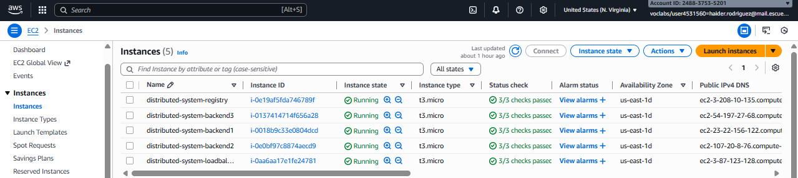
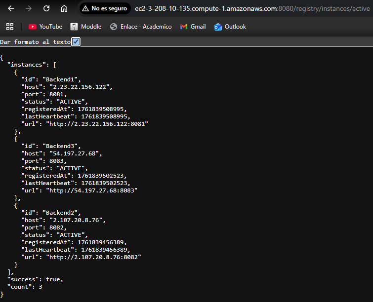
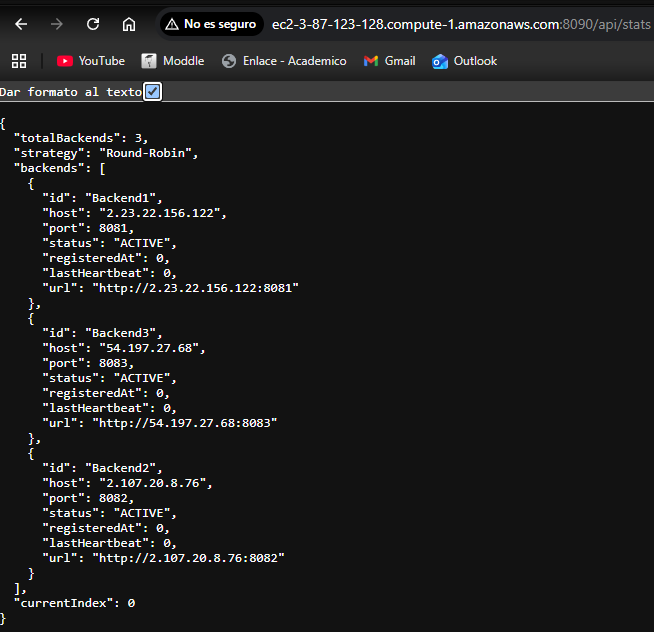
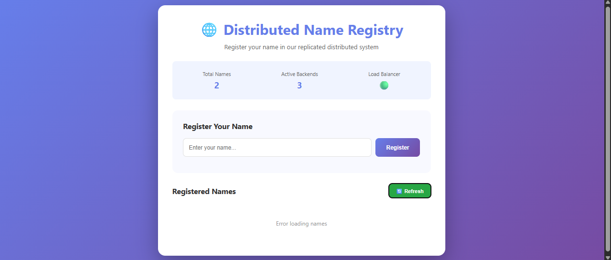

# Distributed Name Registry System

A distributed system implementation featuring data replication using JGroups, load balancing with Round-Robin strategy, and dynamic service discovery. Built with Spring Boot and deployed on AWS EC2.

## 📋 Table of Contents

- [Overview](#overview)
- [Architecture](#architecture)
- [Features](#features)
- [Technology Stack](#technology-stack)
- [Project Structure](#project-structure)
- [Prerequisites](#prerequisites)
- [Local Setup](#local-setup)
- [Docker Deployment](#docker-deployment)
- [AWS EC2 Deployment](#aws-ec2-deployment)
- [API Documentation](#api-documentation)
- [Screenshots](#screenshots)


---

## 🎯 Overview

This project demonstrates a complete distributed system where clients can register names through a web interface. The system uses:

- **JGroups** for data replication across multiple backend nodes
- **Spring Boot** for REST API services
- **Service Registry** for dynamic service discovery
- **Load Balancer** with Round-Robin strategy for request distribution
- **Docker** for containerization
- **AWS EC2** for cloud deployment

### Key Capabilities

- ✅ Real-time data replication across all backend nodes
- ✅ Automatic service registration and discovery
- ✅ Fault tolerance - system continues operating if nodes fail
- ✅ State transfer - new or restarted nodes receive complete data
- ✅ Load balancing with Round-Robin distribution
- ✅ Scalable architecture supporting multiple backend instances

---

## 🏗️ Architecture
```
┌─────────────────────────────────────────────────────────────┐
│                     Web Client (Browser)                     │
│                     JavaScript/HTML/CSS                      │
└────────────────────────────┬────────────────────────────────┘
                             │ HTTP Requests
                             ▼
┌─────────────────────────────────────────────────────────────┐
│                    Load Balancer (8090)                      │
│              Round-Robin Request Distribution                │
└──────┬──────────────────┬──────────────────┬────────────────┘
       │                  │                  │
       │    ┌─────────────┴──────────┐       │
       │    │                        │       │
       ▼    ▼                        ▼       ▼
┌──────────────┐  ┌──────────────┐  ┌──────────────┐
│  Backend 1   │  │  Backend 2   │  │  Backend 3   │
│  (8081)      │  │  (8082)      │  │  (8083)      │
│              │  │              │  │              │
│  Spring Boot │  │  Spring Boot │  │  Spring Boot │
│              │  │              │  │              │
│ ┌──────────┐ │  │ ┌──────────┐ │  │ ┌──────────┐ │
│ │Replicated│ │  │ │Replicated│ │  │ │Replicated│ │
│ │ HashMap  │ │  │ │ HashMap  │ │  │ │ HashMap  │ │
│ └──────────┘ │  │ └──────────┘ │  │ └──────────┘ │
└──────┬───────┘  └──────┬───────┘  └──────┬───────┘
       │                 │                 │
       └────────┬────────┴────────┬────────┘
                │  JGroups Cluster │
                │  (Port 7800)     │
                │  Data Replication│
                └──────────────────┘
                         │
                         │ Service Registration
                         │ & Heartbeat
                         ▼
┌─────────────────────────────────────────────────────────────┐
│              Service Registry (8080)                         │
│         Dynamic Service Discovery & Management               │
└─────────────────────────────────────────────────────────────┘
```

### Component Description

1. **Web Client**: HTML/JavaScript interface for user interaction
2. **Load Balancer**: Distributes incoming requests using Round-Robin
3. **Backend Services (3x)**: Process requests and store data in replicated HashMap
4. **JGroups Cluster**: Ensures all backends have synchronized data
5. **Service Registry**: Maintains list of active backend services

---

## ✨ Features

### Data Replication
- **Automatic synchronization** of data across all backend nodes using JGroups
- **State transfer** ensures new nodes receive complete dataset on startup
- **Cluster view** tracks active members dynamically

### Load Balancing
- **Round-Robin strategy** distributes requests evenly
- **Dynamic backend discovery** from Service Registry
- **Automatic failover** to healthy nodes

### Service Discovery
- **Self-registration** of backend services on startup
- **Heartbeat mechanism** to detect failed services
- **Automatic cleanup** of inactive services

### Fault Tolerance
- System continues operating if backends fail
- Automatic state recovery when backends restart
- No single point of failure (except Load Balancer)

---

## 🛠️ Technology Stack

| Component | Technology | Version |
|-----------|------------|---------|
| **Language** | Java | 17+ |
| **Framework** | Spring Boot | 3.3.3 |
| **Clustering** | JGroups | 5.3.0.Final |
| **Build Tool** | Maven | 3.6+ |
| **Containerization** | Docker | Latest |
| **Cloud Platform** | AWS EC2 | Amazon Linux 2 |
| **Frontend** | HTML/CSS/JavaScript | Vanilla JS |

---

## 📁 Project Structure
```
distributed-system-workshop/
│
├── replicated-datastore/          # Core JGroups implementation
│   ├── src/main/java/
│   │   └── co/edu/escuelaing/distributed/datastore/
│   │       └── ReplicatedHashMap.java
│   ├── pom.xml
│   └── Dockerfile
│
├── backend-service/               # Spring Boot backend
│   ├── src/main/java/
│   │   └── co/edu/escuelaing/distributed/backend/
│   │       ├── BackendApplication.java
│   │       ├── BackendController.java
│   │       ├── BackendConfiguration.java
│   │       ├── RegistryClient.java
│   │       ├── NameEntry.java
│   │       └── RegisterNameRequest.java
│   ├── src/main/java/.../datastore/
│   │   └── ReplicatedHashMap.java (copied)
│   ├── pom.xml
│   └── Dockerfile
│
├── service-registry/              # Service discovery
│   ├── src/main/java/
│   │   └── co/edu/escuelaing/distributed/registry/
│   │       ├── RegistryApplication.java
│   │       ├── RegistryController.java
│   │       ├── RegistryService.java
│   │       └── ServiceInstance.java
│   ├── pom.xml
│   └── Dockerfile
│
├── load-balancer/                 # Load balancer
│   ├── src/main/java/
│   │   └── co/edu/escuelaing/distributed/loadbalancer/
│   │       ├── LoadBalancerApplication.java
│   │       ├── LoadBalancerController.java
│   │       ├── RoundRobinLoadBalancer.java
│   │       └── ServiceInstance.java
│   ├── pom.xml
│   └── Dockerfile
│
├── web-client/                    # Frontend
│   └── index.html
│
├── screenshots/                   # Documentation images
│   ├── aws-instances.png
│   ├── service-registry.png
│   ├── load-balancer-stats.png
│   └── web-client.png
│
├── .gitignore
└── README.md
```

---

## ✅ Prerequisites

### Software Requirements

- **Java JDK 17+**: [Download](https://adoptium.net/)
- **Maven 3.6+**: [Download](https://maven.apache.org/download.cgi)
- **Docker Desktop**: [Download](https://www.docker.com/products/docker-desktop/)
- **Git**: [Download](https://git-scm.com/)
- **AWS Account**: [Sign up](https://aws.amazon.com/) (for cloud deployment)

### Verify Installations
```bash
java -version    # Should show Java 17+
mvn -version     # Should show Maven 3.6+
docker --version # Should show Docker version
git --version    # Should show Git version
```

---

## 🚀 Local Setup

### 1. Clone the Repository
```bash
git clone https://github.com/YOUR_USERNAME/distributed-system-workshop.git
cd distributed-system-workshop
```

### 2. Build All Modules
```bash
# Build each module
cd replicated-datastore
mvn clean install
cd ..

cd backend-service
mvn clean install
cd ..

cd service-registry
mvn clean install
cd ..

cd load-balancer
mvn clean install
cd ..
```

### 3. Run Services Locally (5 terminals)

**Terminal 1 - Service Registry:**
```bash
cd service-registry
java -DPORT=8080 -cp "target/classes:target/dependency/*" \
  co.edu.escuelaing.distributed.registry.RegistryApplication
```

**Terminal 2 - Backend 1:**
```bash
cd backend-service
java -DPORT=8081 -DNODE_NAME=Backend1 \
  -DREGISTRY_URL=http://localhost:8080 \
  -DJGROUPS_TCP_PORT=7800 \
  -DJGROUPS_TCPPING_INITIAL_HOSTS=localhost[7800],localhost[7801],localhost[7802] \
  -cp "target/classes:target/dependency/*" \
  co.edu.escuelaing.distributed.backend.BackendApplication
```

**Terminal 3 - Backend 2:**
```bash
cd backend-service
java -DPORT=8082 -DNODE_NAME=Backend2 \
  -DREGISTRY_URL=http://localhost:8080 \
  -DJGROUPS_TCP_PORT=7801 \
  -DJGROUPS_TCPPING_INITIAL_HOSTS=localhost[7800],localhost[7801],localhost[7802] \
  -cp "target/classes:target/dependency/*" \
  co.edu.escuelaing.distributed.backend.BackendApplication
```

**Terminal 4 - Backend 3:**
```bash
cd backend-service
java -DPORT=8083 -DNODE_NAME=Backend3 \
  -DREGISTRY_URL=http://localhost:8080 \
  -DJGROUPS_TCP_PORT=7802 \
  -DJGROUPS_TCPPING_INITIAL_HOSTS=localhost[7800],localhost[7801],localhost[7802] \
  -cp "target/classes:target/dependency/*" \
  co.edu.escuelaing.distributed.backend.BackendApplication
```

**Terminal 5 - Load Balancer:**
```bash
cd load-balancer
java -DPORT=8090 -DREGISTRY_URL=http://localhost:8080 \
  -cp "target/classes:target/dependency/*" \
  co.edu.escuelaing.distributed.loadbalancer.LoadBalancerApplication
```

### 4. Open Web Client
```bash
cd web-client
# Open index.html in your browser
```

Or double-click `index.html`

---

## 🐳 Docker Deployment

### 1. Build Docker Images
```bash
# Backend Service
cd backend-service
docker build -t backend-service .

# Service Registry
cd ../service-registry
docker build -t service-registry .

# Load Balancer
cd ../load-balancer
docker build -t load-balancer .
```

### 2. Push to Docker Hub
```bash
# Login
docker login

# Tag images
docker tag service-registry YOUR_DOCKERHUB_USERNAME/service-registry:latest
docker tag backend-service YOUR_DOCKERHUB_USERNAME/backend-service:latest
docker tag load-balancer YOUR_DOCKERHUB_USERNAME/load-balancer:latest

# Push
docker push YOUR_DOCKERHUB_USERNAME/service-registry:latest
docker push YOUR_DOCKERHUB_USERNAME/backend-service:latest
docker push YOUR_DOCKERHUB_USERNAME/load-balancer:latest
```

---

## ☁️ AWS EC2 Deployment

### 1. Create EC2 Instances

Create 5 EC2 instances with:
- **AMI**: Amazon Linux 2
- **Instance Type**: t2.micro (Free tier eligible)
- **Key Pair**: Create or use existing
- **Security Groups**: Configure as follows

#### Security Group Configuration

**Service Registry (Port 8080):**
- SSH: 22 (0.0.0.0/0)
- Custom TCP: 8080 (0.0.0.0/0)

**Backend Instances (Ports 8081, 8082, 8083):**
- SSH: 22 (0.0.0.0/0)
- Custom TCP: 808X (0.0.0.0/0) - where X is 1, 2, or 3
- Custom TCP: 7800 (0.0.0.0/0) - for JGroups

**Load Balancer (Port 8090):**
- SSH: 22 (0.0.0.0/0)
- Custom TCP: 8090 (0.0.0.0/0)

### 2. Install Docker on Each Instance
```bash
# Connect via SSH
ssh -i your-key.pem ec2-user@YOUR_INSTANCE_IP

# Install Docker
sudo yum update -y
sudo yum install docker -y
sudo service docker start
sudo usermod -a -G docker ec2-user

# Logout and login again for group changes to take effect
exit
ssh -i your-key.pem ec2-user@YOUR_INSTANCE_IP
```

### 3. Deploy Services

**Note:** Replace IPs with your actual instance IPs

#### Service Registry
```bash
docker pull YOUR_DOCKERHUB_USERNAME/service-registry:latest

docker run -d -p 8080:8080 --name registry \
  YOUR_DOCKERHUB_USERNAME/service-registry:latest
```

#### Backend 1
```bash
docker pull YOUR_DOCKERHUB_USERNAME/backend-service:latest

docker run -d -p 8081:8081 -p 7800:7800 \
  -e PORT=8081 \
  -e NODE_NAME=Backend1 \
  -e REGISTRY_URL=http://REGISTRY_IP:8080 \
  -e SERVICE_HOST=BACKEND1_IP \
  -e JGROUPS_EXTERNAL_ADDR=BACKEND1_IP \
  -e JGROUPS_TCP_PORT=7800 \
  -e JGROUPS_TCPPING_INITIAL_HOSTS=BACKEND1_IP[7800],BACKEND2_IP[7800],BACKEND3_IP[7800] \
  --name backend1 \
  YOUR_DOCKERHUB_USERNAME/backend-service:latest
```

#### Backend 2 & 3

Repeat with appropriate port numbers (8082, 8083) and names.

#### Load Balancer
```bash
docker pull YOUR_DOCKERHUB_USERNAME/load-balancer:latest

docker run -d -p 8090:8090 \
  -e PORT=8090 \
  -e REGISTRY_URL=http://REGISTRY_IP:8080 \
  --name loadbalancer \
  YOUR_DOCKERHUB_USERNAME/load-balancer:latest
```

### 4. Update Web Client

Edit `web-client/index.html`:
```javascript
const LOAD_BALANCER_URL = 'http://LOADBALANCER_PUBLIC_IP:8090';
```

---

## 📚 API Documentation

### Service Registry

#### GET `/registry/instances/active`
Get all active backend instances

**Response:**
```json
{
  "success": true,
  "count": 3,
  "instances": [...]
}
```

#### POST `/registry/register`
Register a new service instance

**Request:**
```json
{
  "id": "Backend1",
  "host": "localhost",
  "port": 8081
}
```

#### POST `/registry/heartbeat/{id}`
Send heartbeat for service instance

---

### Backend Services

#### POST `/api/register`
Register a new name

**Request:**
```json
{
  "name": "Alice"
}
```

**Response:**
```json
{
  "success": true,
  "message": "Name registered successfully",
  "name": "Alice",
  "timestamp": 1698765432000
}
```

#### GET `/api/names`
Get all registered names

**Response:**
```json
{
  "success": true,
  "count": 2,
  "entries": [
    {"name": "Alice", "timestamp": 1698765432000},
    {"name": "Bob", "timestamp": 1698765433000}
  ]
}
```

#### GET `/api/health`
Health check endpoint

#### GET `/api/info`
Get backend node information

---

### Load Balancer

#### POST `/api/register`
Forward registration request to backend (Round-Robin)

#### GET `/api/names`
Forward get names request to backend (Round-Robin)

#### GET `/api/stats`
Get load balancer statistics

**Response:**
```json
{
  "totalBackends": 3,
  "backends": [...],
  "currentIndex": 2,
  "strategy": "Round-Robin"
}
```

---

## 📸 Screenshots

### AWS EC2 Instances


### Service Registry


### Load Balancer Stats


### Web Client Interface



